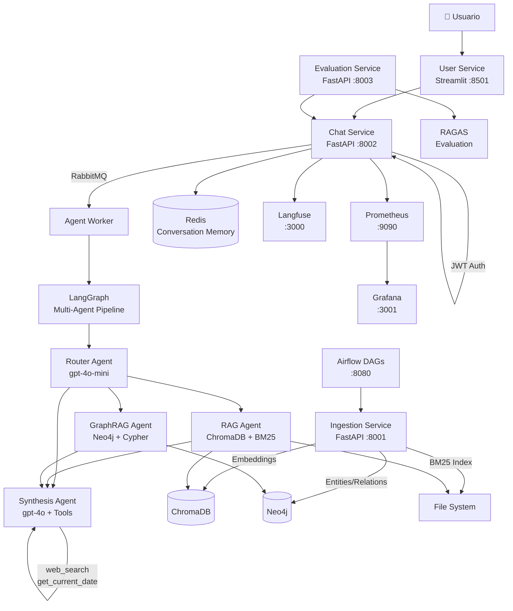
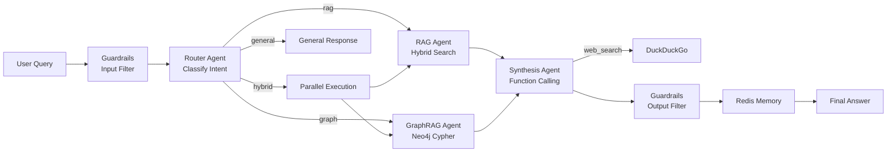

# 🔬 Omni-Analyst — Academic Research Intelligence System

> **Bootcamp 2026 — Proyecto Final**
> Sistema Multiagente de Inteligencia sobre Papers Científicos de ArXiv

[](https://github.com/manuelmz12/proyecto_final/actions/workflows/ci.yml)

---

## 🎯 Caso de Uso y Justificación de IA

**Problema:** El volumen de publicaciones científicas en ArXiv crece a más de 200 papers/día solo en cs.AI. Un analista de I+D no puede mantenerse al día manualmente. Las búsquedas tradicionales por keywords no capturan similitud semántica ni relaciones entre entidades (autores, instituciones, redes de citas).

**Solución:** Omni-Analyst es un sistema multiagente que ingiere, indexa y razona sobre literatura científica de ArXiv usando:
- **RAG híbrido** (búsqueda semántica + léxica) para responder preguntas sobre contenido de papers
- **GraphRAG** (grafo de conocimiento Neo4j) para responder sobre relaciones entre entidades
- **Multi-agente LangGraph** que combina ambos enfoques según la intención del usuario

**Ejemplo de queries complejas que resuelve:**
- *"¿Cuáles son los papers más influyentes sobre RAG publicados en 2024?"* → RAG Agent
- *"¿Qué autores del MIT publican sobre LLMs y con quién colaboran?"* → GraphRAG Agent
- *"Resume los avances en Mamba vs Transformers y busca si hay algo más reciente"* → Hybrid + Web Search Tool

---

## 🏗️ Arquitectura

### Diagrama de Servicios



### Diagrama de Flujo de Agentes



### Diagrama del Grafo de Conocimiento (Neo4j)

```
(Paper {arxiv_id, title, abstract, published})
    ├─[:WROTE]──────────── (Author {name})
    │                           └─[:AFFILIATED_WITH]── (Institution {name})
    ├─[:CITES]──────────── (Paper)
    ├─[:FROM_INSTITUTION]── (Institution)
    └─[:COVERS]─────────── (Concept {name})
```

---

## 🛠️ Stack Tecnológico

| Módulo | Tecnología |
|---|---|
| LLM | Azure OpenAI (GPT-4o / GPT-4o-mini) |
| Embeddings | Azure OpenAI text-embedding-3-small |
| Vector DB | ChromaDB |
| Graph DB | Neo4j 5.x |
| Cache/Memoria | Redis 7 |
| Message Queue | RabbitMQ 3.13 |
| Orquestación DAGs | Apache Airflow 2.9 |
| Agentes | LangGraph + LangChain |
| Auth | JWT (python-jose) |
| Guardarraíles | Presidio (PII) + Detoxify (toxicidad) |
| Evaluación | RAGAS (faithfulness, relevancy, recall) |
| Telemetría LLM | Langfuse (self-hosted) |
| Métricas sistema | Prometheus + Grafana |
| Frontend | Streamlit |
| CI/CD | GitHub Actions |
| Contenedores | Docker Compose |

---

## 📦 Estructura del Proyecto

```
proyecto_final/
├── .github/workflows/ci.yml        # CI: tests + docker build
├── docker-compose.yml              # Orquesta todos los servicios
├── .env.example                    # Variables de entorno (plantilla)
│
├── airflow/
│   └── dags/ingestion_dag.py       # DAG diario de ingesta ArXiv
│
├── services/
│   ├── ingestion-service/          # Módulo A: pipeline de ingesta
│   │   ├── main.py                 # FastAPI :8001
│   │   └── pipeline/
│   │       ├── arxiv_loader.py     # Fuente 1: ArXiv API
│   │       ├── semantic_scholar.py # Fuente 2: Semantic Scholar API
│   │       ├── embedder.py         # Azure OpenAI embeddings
│   │       ├── vector_store.py     # ChromaDB client
│   │       ├── graph_store.py      # Neo4j + entity extraction LLM
│   │       └── bm25_index.py       # Índice léxico BM25
│   │
│   ├── chat-service/               # Módulo C: multiagente + auth
│   │   ├── main.py                 # FastAPI :8002
│   │   ├── agents/
│   │   │   ├── graph.py            # LangGraph workflow
│   │   │   ├── router_agent.py     # Agente 1: clasificador de intención
│   │   │   ├── rag_agent.py        # Agente 2: RAG híbrido
│   │   │   ├── graph_rag_agent.py  # Agente 3: text-to-Cypher
│   │   │   └── synthesis_agent.py  # Agente 4: síntesis + tools
│   │   ├── auth/jwt_handler.py     # JWT authentication
│   │   ├── memory/redis_memory.py  # Conversación en Redis
│   │   ├── guardrails/             # PII detection + toxicidad
│   │   ├── tools/                  # web_search + current_date
│   │   └── catalog/agents_catalog.yaml
│   │
│   ├── user-service/               # Módulo B: Streamlit UI
│   │   └── app.py                  # Demo :8501
│   │
│   └── evaluation-service/         # Módulo D: RAGAS evaluation
│       ├── main.py                 # FastAPI :8003
│       ├── evaluator.py            # RAGAS pipeline
│       └── test_questions.json     # 20 Q&A de prueba
│
├── monitoring/
│   ├── prometheus.yml
│   └── grafana/
│       ├── datasources.yml
│       └── dashboards/omni_analyst.json
│
└── tests/
    ├── test_ingestion.py
    ├── test_chat.py
    └── test_evaluation.py
```

---

## 🚀 Instalación y Ejecución

### Prerrequisitos
- Docker Desktop (con al menos 8 GB RAM asignados)
- Git

### 1. Clonar el repositorio
```bash
git clone https://github.com/manuelmz12/proyecto_final.git
cd proyecto_final
```

### 2. Configurar variables de entorno
```bash
cp .env.example .env
# Editar .env con tus credenciales de Azure OpenAI
```

Variables obligatorias en `.env`:
```bash
AZURE_OPENAI_API_KEY=your_key_here
AZURE_OPENAI_ENDPOINT=https://your-resource.openai.azure.com/
AZURE_OPENAI_DEPLOYMENT_CHAT=gpt-4o
AZURE_OPENAI_DEPLOYMENT_MINI=gpt-4o-mini
AZURE_OPENAI_DEPLOYMENT_EMBEDDINGS=text-embedding-3-small
```

### 3. Levantar todos los servicios
```bash
docker-compose up --build
```

La primera vez tardará ~5-10 minutos en descargar las imágenes. Cuando todos los servicios estén listos:

| Servicio | URL |
|---|---|
| 🖥️ Demo Streamlit | http://localhost:8501 |
| 🤖 Chat API | http://localhost:8002/docs |
| 📥 Ingestion API | http://localhost:8001/docs |
| 📊 Evaluation API | http://localhost:8003/docs |
| 🔍 Langfuse (LLM traces) | http://localhost:3000 |
| 📈 Grafana (métricas) | http://localhost:3001 |
| 🔧 Airflow | http://localhost:8080 |
| 🐰 RabbitMQ Management | http://localhost:15672 |
| 🗄️ Neo4j Browser | http://localhost:7474 |

### 4. Ingestar datos iniciales
```bash
# Trigger manual de ingesta (50 papers de cs.AI y cs.LG)
curl -X POST http://localhost:8001/ingest/trigger/sync \
  -H "Content-Type: application/json" \
  -d '{"categories": ["cs.AI", "cs.LG"], "max_papers": 50, "days_back": 7}'
```

O desde la UI de Streamlit: **Navigation → 📥 Ingestion → 🚀 Trigger Ingestion**

### 5. Usar el chat
Accede a http://localhost:8501 con credenciales:
- `demo` / `demo123`
- `admin` / `admin123`

---

## 🔬 Módulos en Detalle

### Módulo A: Pipeline de Ingesta
- **Fuente 1:** ArXiv API — abstracts, títulos, autores, categorías
- **Fuente 2:** Semantic Scholar API — citaciones, afiliaciones, h-index
- **Embeddings:** `text-embedding-3-small` (Azure OpenAI) → ChromaDB
- **Extracción de entidades:** GPT-4o-mini extrae conceptos e instituciones → Neo4j
- **BM25:** índice léxico persistido en JSON para búsqueda híbrida
- **Airflow DAG:** schedule `0 6 * * *` (daily at 6am UTC)

### Módulo C: Sistema Multiagente LangGraph
1. **Router Agent** (gpt-4o-mini): Clasifica la intención → rag/graph/hybrid/general
2. **RAG Agent** (gpt-4o-mini): Búsqueda híbrida ChromaDB (dense) + BM25 (lexical) con Reciprocal Rank Fusion
3. **GraphRAG Agent** (gpt-4o): Text-to-Cypher sobre Neo4j con síntesis de resultados
4. **Synthesis Agent** (gpt-4o): Consolida resultados + function calling (web_search, get_current_date)

### Módulo D: Evaluación RAGAS
```bash
# Trigger evaluación (10 preguntas por defecto)
curl -X POST http://localhost:8003/evaluate/run \
  -H "Content-Type: application/json" \
  -d '{"max_questions": 10}'

# Ver resultados
curl http://localhost:8003/evaluate/results
```

Métricas evaluadas:
- **Faithfulness:** ¿La respuesta está soportada por el contexto recuperado? (0-1)
- **Answer Relevancy:** ¿La respuesta es relevante a la pregunta? (0-1)
- **Context Recall:** ¿Se recuperó el contexto correcto? (0-1)

---

## 📊 Observabilidad

### Langfuse (Trazas LLM)
1. Acceder a http://localhost:3000
2. Registrarse con cualquier email/contraseña
3. Crear un proyecto y copiar las API keys a `.env`
4. Reiniciar los servicios con `docker-compose restart chat-service`

### Grafana (Métricas del sistema)
- URL: http://localhost:3001 (admin/admin)
- Dashboard pre-configurado: **Omni-Analyst Dashboard**
- Incluye: latencia P95, throughput, papers ingestados, scores RAGAS, bloques de guardarraíles

---

## 🔒 Seguridad y Guardarraíles

- **JWT Auth:** Todos los endpoints de chat requieren Bearer token (`POST /auth/login`)
- **PII Detection:** Microsoft Presidio detecta y redacta emails, teléfonos, tarjetas de crédito en inputs
- **Prompt Injection:** Regex patterns bloquean instrucciones maliciosas comunes
- **Toxicity Filter:** Detoxify filtra outputs con puntuación de toxicidad > 0.7
- **Out-of-domain:** Keywords de contenido dañino bloquean respuestas del agente

---

## 🧪 Tests

```bash
# Ejecutar tests localmente
pip install pytest pytest-asyncio pytest-cov
pytest tests/ -v --cov
```

---

## 🌿 Estrategia de Ramas

```
main           ← código estable, solo merge desde develop via PR
develop        ← integración, merge de features
feature/A-*    ← Módulo A (ingesta)
feature/B-*    ← Módulo B (user service)
feature/C-*    ← Módulo C (chat/agentes)
feature/D-*    ← Módulo D (evaluación)
feature/E-*    ← Módulo E (DevOps/CI)
```

---

## 🙏 Créditos

Proyecto desarrollado como MVP final del **AI Engineering Bootcamp 2026**.

Tecnologías principales: LangGraph, Azure OpenAI, ChromaDB, Neo4j, RAGAS, Langfuse, Airflow, FastAPI, Streamlit.
